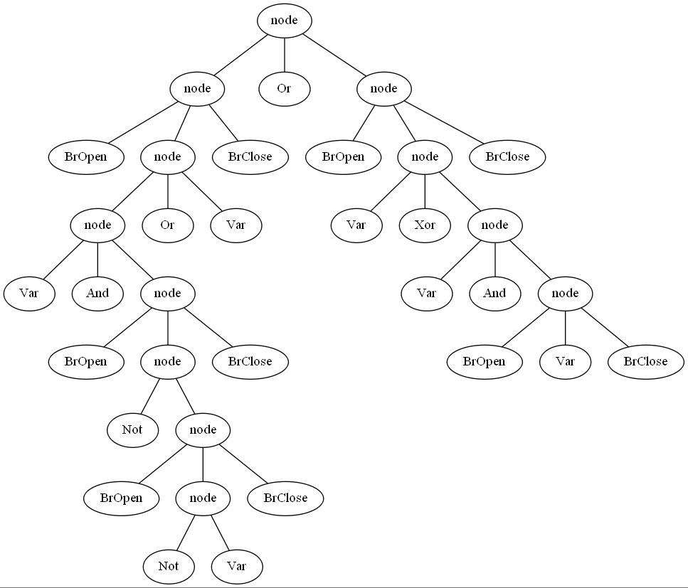

# [Содержание](./../../README.md)

+ **2 lab - Лабораторная работа по ручному построению нисходящих парсеров**
+ [3 lab - Лабораторная работа по автоматическим генераторам парсеров](./../Lab3/README.md)
    + [Автоматически сгенерированный код](./../Lab3/README.md)
    + [Грамматика для Python To C](./../../resources/PythonToC/README.md)
+ [4 lab - Лабораторная работа по написанию генераторов парсеров](./../Lab4/README.md);

***

# 2 лабораторная работа

## Введение

Цель данной лабораторной работы — научиться разрабатывать грамматики для заданных неформально языков с учетом
семантического смысла и приоритета операторов, разрабатывать лексические анализаторы, разрабатывать вручную нисходящие
синтаксические анализаторы, разрабатывать подробные тестовые наборы для анализаторов.
<br/><br/>**Форма отчетности:** программа и текстовый отчет. Программа может быть написана на любом языке
программирования общего назначения
(рекомендуются Си++ и Java).
***

## Вариант 3 - Логические формулы в стиле Python

Используются операции `and`, `or`, `xor`, `not`. Приоритет операций стандартный. Скобки могут использоваться для
изменения приоритета.
<br/><br/>В качестве операндов выступают переменные с именем из одной буквы. Используйте один терминал для всех
переменных. Для каждой логической операции должен быть заведен один терминал (не три `‘a’`,`‘n’`,`‘d’` для `and`).
<br/><br/>**Пример:** `(a and b) or not (c xor (a or not b))`
***

## Комментарии по реализации

В качестве основного языка написания лабораторной работы был выбран *Haskell*. Лабораторная писалась во время изучения
курса функционального программирования (*Haskell*), поэтому применялся разный набор инструментов для реализации (для
освоения на практике пройденного материала).

### Получившаяся грамматика

```
E → E’O
O → xor E’O
O → or E’O
O → ε
E’ → NA
A → and NA
A → ε
N → not N
N → T
T → (E)
T → var
```

### [Token.hs](./Token.hs)

Экспортирует лексический анализатор и набор разбираемы токенов.
<br/><br/>Т.к. по одному из условий требовалось написать лексический анализатор, то был выбран путь отличный от
общепринятого на Haskell (написание `Parser`, впрочем, данная реализация в конечном итоге тоже была написана, но
в [лабораторной 4](./../Lab4/README.md)), а именно реализация лексического анализатора отдельно от парсера.

### [Tree.hs](./Tree.hs)

Экспортирует нисходящий синтаксический анализатор.
<br/><br/>Т.к. по заданию требовалось построить рекурсивный нисходящий парсер, то для удобства дальнейшей модификации
была выбрана древовидная структура разбора (соответсвующаяя представленной выше грамматике).

### [Graph.hs](./Graph.hs)

Экспортирует функцию для отрисовки дерева разбора с помощью **[GraphViz](https://graphviz.org/)**
(для исполнения **требуется предустановить** данную утилиту).
***

## Пример

**Входные данные:** `"(c and (not (not f)) or x) or (t xor f and (r)) "`

**Построенное дерево разбора:**
